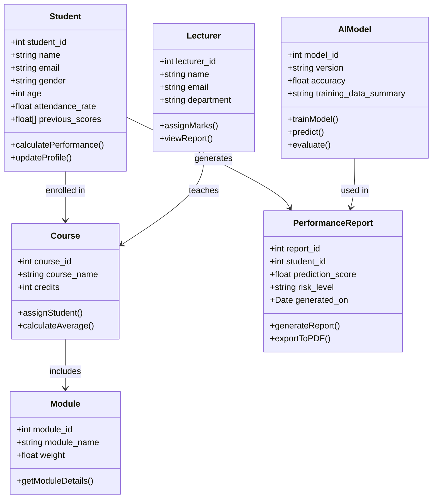

```mermaid
classDiagram
    class Student {
        +int student_id
        +string name
        +string email
        +string gender
        +int age
        +float attendance_rate
        +float[] previous_scores
        +calculatePerformance()
        +updateProfile()
    }

    class Course {
        +int course_id
        +string course_name
        +int credits
        +assignStudent()
        +calculateAverage()
    }

    class Module {
        +int module_id
        +string module_name
        +float weight
        +getModuleDetails()
    }

    class Lecturer {
        +int lecturer_id
        +string name
        +string email
        +string department
        +assignMarks()
        +viewReport()
    }

    class PerformanceReport {
        +int report_id
        +int student_id
        +float prediction_score
        +string risk_level
        +Date generated_on
        +generateReport()
        +exportToPDF()
    }

    class AIModel {
        +int model_id
        +string version
        +float accuracy
        +string training_data_summary
        +trainModel()
        +predict()
        +evaluate()
    }

    Student --> PerformanceReport : generates
    Student --> Course : enrolled in
    Course --> Module : includes
    Lecturer --> Course : teaches
    AIModel --> PerformanceReport : used in
```
