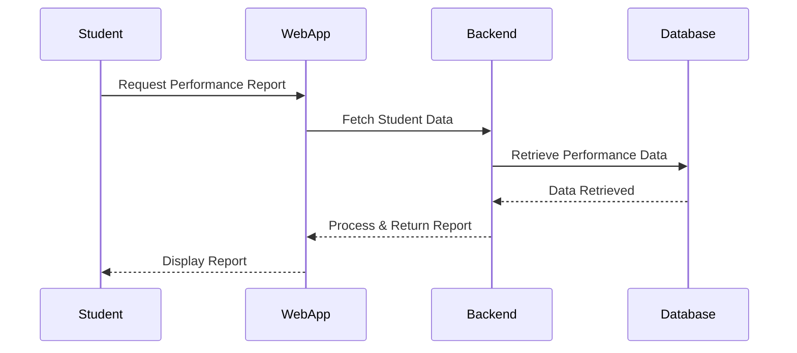

 # AI-Powered Student Performance Prediction System

 # 📋 Table of Contents
Installation

Setup & Configuration

Usage Instructions

Project Features

System Specifications

Architecture Overview

Domain Model

Collaboration

Credits

---

# 🎓 Student Performance Prediction System (AI-Powered)
This project aims to use Artificial Intelligence to predict student academic performance based on historical data. The system provides insights to educators and administrators to identify at-risk students and provide timely interventions.

# 📊 Student Performance Prediction System
📌 Project Overview
The Student Performance Prediction System is an AI-powered application designed to analyze student data and predict academic performance. The system helps educators and students identify learning trends, strengths, and areas requiring improvement.

# 🚀 Features
✅ AI-Powered Performance Prediction – Uses machine learning to predict student grades based on historical data.
✅ Interactive Dashboard – Displays student reports, learning recommendations, and insights.
✅ Database Integration – Stores and retrieves student academic records securely.
✅ Role-Based Access – Students, teachers, and administrators have different access levels.
✅ Learning Recommendations – Provides AI-generated study resources based on performance analysis.
✅ Data Visualization – Generates performance graphs, trends, and analytics.

# 🛠️ Tech Stack
Frontend: React Native
Backend: Flask (Python)
Database: SQL
AI Model: Scikit-Learn / TensorFlow
Version Control: Git & GitHub

📥 Installation & Setup
1️⃣ Clone the Repository
bash
Copy
Edit
git clone https://github.com/SisiphoM/StudentPerformanceAI.git
cd StudentPerformanceAI
2️⃣ Set Up Backend
bash
Copy
Edit
cd backend
python -m venv env
source env/bin/activate  # On Windows, use `env\Scripts\activate`
pip install -r requirements.txt
python app.py
3️⃣ Set Up Frontend
bash
Copy
Edit
cd frontend
npm install
npm start

📌 Usage Guide
🔹 For Students:
Log in and view academic performance trends.

Get personalized learning recommendations.

🔹 For Teachers:
Generate and analyze student performance reports.

Provide academic feedback based on AI predictions.

🔹 For Administrators:
Manage student records and system access.

Monitor overall academic performance at an institutional level.

Project Management (GitHub Issues & Milestones)
This project follows Agile Development with the following milestones:

1️⃣ Sprint 1: System Setup & UI Development

Implement the initial frontend interface.

Set up the backend and database.

2️⃣ Sprint 2: AI Model Integration & Performance Optimization

Train the machine learning model for predictions.

Optimize system performance for large datasets.

3️⃣ Sprint 3: Testing & Deployment

Conduct user testing and fix issues.

Deploy the application to a cloud server.

📧 Contact
For any inquiries, contact Sisipho Mdaka at [mdakasisipho@gmail.com].

## Documentation
- [System Specification](SPECIFICATION.md)
- [Architecture Documentation](ARCHITECTURE.md)

## Key Features  
**Student Reports** – View detailed academic performance reports.  
**AI-Based Learning Suggestions** – Personalized study plans for students.  
**Teacher Dashboard** – Monitor student progress and generate reports.  
**Parent Portal** – Allows parents to track student performance.  
**Secure User Access** – Role-based authentication for students, teachers, and admins.  
**Data Integration** – Connects with school databases to keep records updated.  

---

AI Model: Analyzes student performance trends.
Database: Stores student records, grades, and attendance.
Frontend: Web dashboard for students, teachers, and parents.
Backend: Handles API requests and runs AI predictions.

---

## Usage Instructions
1️⃣ Log in as a Student, Teacher, or Admin.
2️⃣ View Reports to analyze academic performance.
3️⃣ Generate Reports (Teachers only).
4️⃣ Get Study Recommendations based on AI analysis.

---

## 🔐 Security & Access Control
Student Access: Can view reports and receive recommendations.
Teacher Access: Can view, analyze, and generate reports.
Admin Access: Manages users and controls system settings.

---

## Data Flow diagram 
Step 1: Student requests a performance report.
Step 2: Backend retrieves data from the database.
Step 3: AI model analyzes past trends.
Step 4: The final report is displayed to the student.

---

## Deployment & Setup
Frontend: React, hosted on Vercel or Netlify.
Backend: Flask, deployed on AWS EC2 or Heroku.
Database: PostgreSQL, hosted on AWS RDS.

---

## System Interaction Flow
The diagram below shows how different components interact when a student requests a performance report.

---

## Template comparison 

| **Template Name**   | **Columns & Workflows**                                      | **Automation Features**                            | **Suitability for Agile**                                  |
|--------------------|------------------------------------------------|--------------------------------------|--------------------------------------------------|
| **Basic Kanban**    | To Do, In Progress, Done                      | Manual updates                      | Suitable for simple tracking but lacks automation. |
| **Automated Kanban** | Backlog, Ready, In Progress, Review, Done     | Issues move automatically between stages | Best for Agile sprints and automated tracking. |
| **Bug Triage**      | New Issues, Needs Triage, Accepted, In Progress, Done | Helps prioritize and track bugs effectively | Best for debugging and issue management. |

## Chosen Template: Automated Kanban

### Justification:
The **Automated Kanban** template is the most suitable for our project because:

- **Supports Agile Sprints** – The structure aligns with Agile workflows, making sprint tracking more efficient.
- **Built-in Automation** – Issues automatically progress through different stages, reducing the need for manual updates.
- **Improved Visibility** – Provides a clear view of the development process, ensuring transparency.
- **Reduces Manual Effort** – Developers and project managers spend less time moving tasks manually between stages.
- **Best for Feature Development & Bug Tracking** – This template is ideal for managing both **new features** and **bug fixes**, making it well-suited for our project.

By using this template, we streamline our project management process, making it easier to track progress, review issues, and maintain efficiency.

