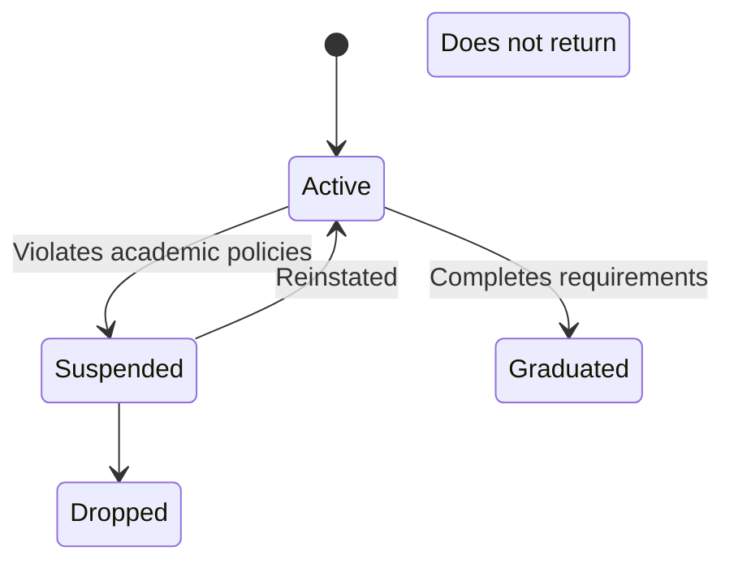
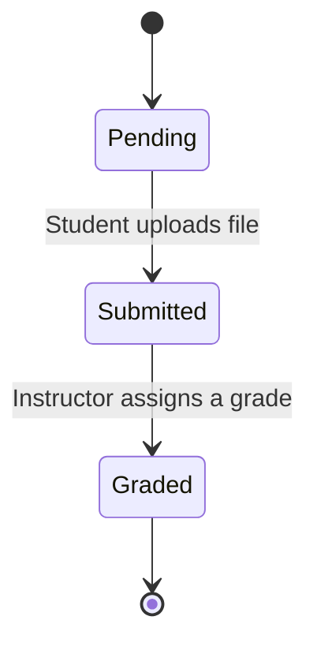
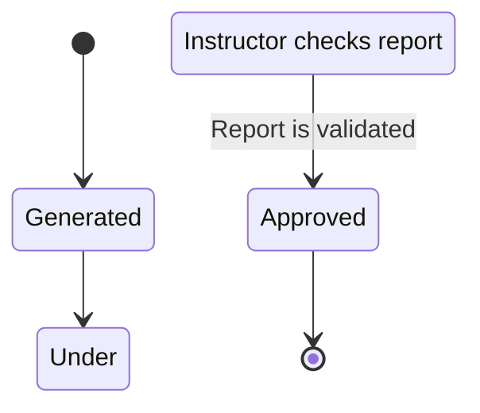
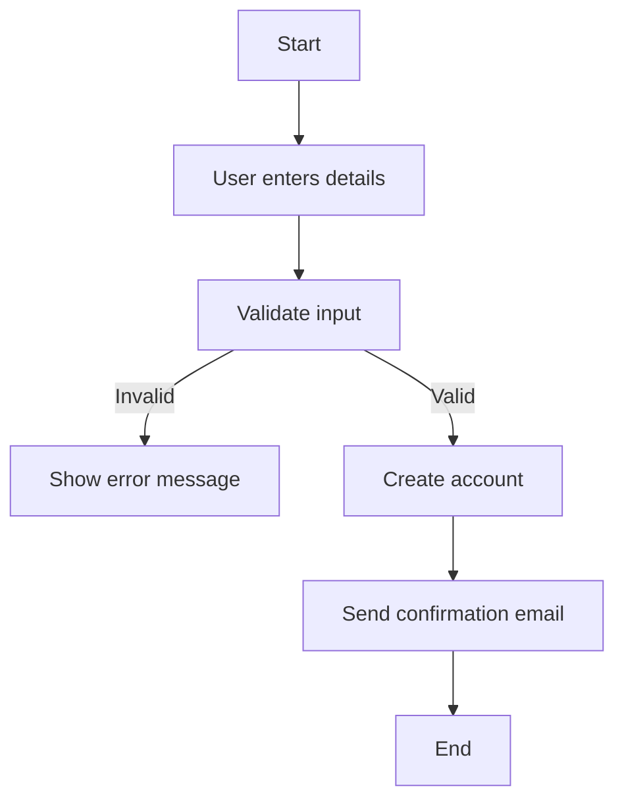
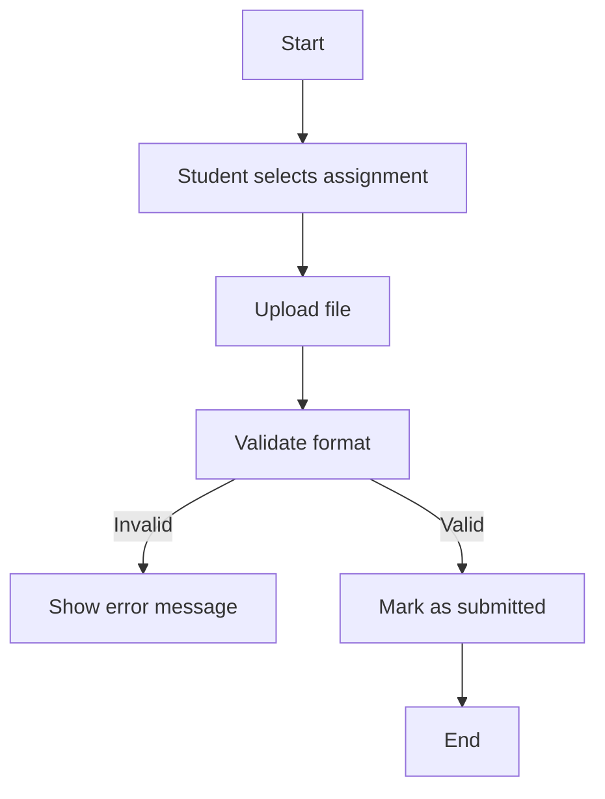

Below are state transition diagrams for critical objects in the Student Performance Prediction System.

### **1.1 Student State Transition**

**Explanation:**
- A student starts in the **Active** state.
- If they violate academic policies, they get **Suspended**.
- Suspended students can either be **Reinstated** or **Drop Out**.
- If they complete their studies, they **Graduate**.

---

### **1.2 Assignment Submission State Transition**

**Explanation:**
- A student starts with a **Pending** assignment.
- Once uploaded, it moves to **Submitted**.
- After grading, it reaches the final state **Graded**.

---

### **1.3 Performance Report State Transition**

**Explanation:**
- The system **Generates** a report.
- The report goes **Under Review**.
- Once validated, it is **Approved**.

---

## 2. Activity Workflow Modeling with Activity Diagrams (40 Marks)

### **2.1 Student Registration Workflow**

**Explanation:**
- Users enter registration details.
- If invalid, an error message is shown.
- If valid, the account is created, and an email is sent.

---

### **2.2 Submit Assignment Workflow**

**Explanation:**
- A student selects and uploads an assignment.
- If the format is invalid, an error is shown.
- If valid, the assignment is **Submitted**.
